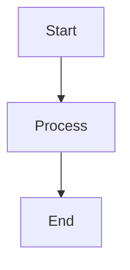

# mermaid-markdown-wrap

[English](README.md) | [日本語](README.ja.md)

`.mmd`や`.mermaid`ファイル（Mermaidダイアグラム）を、元の内容を変更せずにMarkdownのコードブロックでラップするミニマルなCLIツールです。

## Quick Start

```bash
# グローバルインストール
npm install -g mermaid-markdown-wrap

# MermaidファイルをMarkdownに変換
mermaid-markdown-wrap diagram.mmd
```

## Features

- ✅ `.mmd`と`.mermaid`ファイルを適切なコードブロックでMarkdownに変換
- ✅ グロブパターンによるバッチ処理
- ✅ 柔軟な設定（YAML、JSON、JavaScript、TypeScript）
- ✅ GitHub Actionsサポート
- ✅ コマンド検証と設定確認ツール

## Usage

### Basic Examples

```bash
# 単一ファイルの変換
mermaid-markdown-wrap diagram.mmd

# 複数ファイルの変換
mermaid-markdown-wrap "**/*.mmd"

# 出力ディレクトリを指定
mermaid-markdown-wrap "src/**/*.{mmd,mermaid}" --out-dir docs

# 変換後もソースファイルを保持
mermaid-markdown-wrap diagram.mmd --keep-source
```

### Options

| オプション            | 説明                          | デフォルト         |
| --------------------- | ----------------------------- | ------------------ |
| `-o, --out-dir <dir>` | 出力ディレクトリ              | 入力ファイルと同じ |
| `--extension <ext>`   | 出力ファイルの拡張子          | `.md`              |
| `--header <text>`     | 出力の先頭に追加するテキスト  | -                  |
| `--footer <text>`     | 出力の末尾に追加するテキスト  | -                  |
| `--keep-source`       | ソースファイルを保持          | `false`            |
| `--no-show-command`   | 出力にコマンドを表示しない    | `false`            |
| `-c, --config <file>` | 設定ファイルのパス            | 自動検索           |
| `-h, --help`          | ヘルプを表示                  | -                  |
| `-v, --version`       | バージョンを表示              | -                  |

## Commands

### Convert（デフォルト）

```bash
mermaid-markdown-wrap <glob> [options]
```

MermaidファイルをMarkdownに変換します。サブコマンドを指定しない場合のデフォルトコマンドです。

### Config Show

現在の設定を表示:

```bash
# 自動検出された設定を表示
mermaid-markdown-wrap config-show

# 特定の設定ファイルを表示
mermaid-markdown-wrap config-show myconfig.yaml
```

### Config Validate

設定ファイルのエラーをチェック:

```bash
# 自動検出された設定を検証
mermaid-markdown-wrap config-validate

# 特定の設定ファイルを検証
mermaid-markdown-wrap config-validate myconfig.json
```

## Configuration

ツールは以下の場所から自動的に設定ファイルを検索します（[cosmiconfig](https://github.com/cosmiconfig/cosmiconfig)を使用）：

- `package.json` (`"mermaid-markdown-wrap"`プロパティ)
- `.mermaid-markdown-wraprc` （拡張子なし）
- `.mermaid-markdown-wraprc.{json,yaml,yml,js,ts,mjs,cjs}`
- `.config/mermaid-markdown-wraprc` （拡張子なし）
- `.config/mermaid-markdown-wraprc.{json,yaml,yml,js,ts,mjs,cjs}`
- `mermaid-markdown-wrap.config.{js,ts,mjs,cjs}`

`-c`オプションで設定ファイルを指定することも可能です。

### YAML設定

```yaml
# .mermaid-markdown-wraprc.yaml
outDir: docs
extension: .md
header: |
  <!-- AUTO-GENERATED, DO NOT EDIT -->
footer: |
  _(Generated by mermaid-markdown-wrap)_
keepSource: true
```

> **ヒント**: YAMLファイルでIntelliSenseを有効にする方法：
> 
> **オプション1 - VS Code設定** ([YAML拡張機能](https://marketplace.visualstudio.com/items?itemName=redhat.vscode-yaml)を使用)：
> ```json
> // .vscode/settings.json
> {
>   "yaml.schemas": {
>     "https://unpkg.com/mermaid-markdown-wrap/schema/config.schema.json": [
>       ".mermaid-markdown-wraprc",
>       ".mermaid-markdown-wraprc.yaml",
>       ".mermaid-markdown-wraprc.yml",
>       ".config/mermaid-markdown-wraprc",
>       ".config/mermaid-markdown-wraprc.yaml",
>       ".config/mermaid-markdown-wraprc.yml"
>     ]
>   }
> }
> ```
> 
> **オプション2 - YAMLコメント** (一部のエディタでサポート)：
> ```yaml
> # yaml-language-server: $schema=https://unpkg.com/mermaid-markdown-wrap/schema/config.schema.json
> outDir: docs
> extension: .md
> ```

### JSON設定（スキーマ付き）

```json
// .mermaid-markdown-wraprc.json
{
  "$schema": "https://unpkg.com/mermaid-markdown-wrap/schema/config.schema.json",
  "outDir": "docs",
  "extension": ".md",
  "header": "<!-- AUTO-GENERATED -->",
  "footer": "<!-- END -->",
  "keepSource": true
}
```

`$schema`プロパティにより、対応エディタでIntelliSense、検証、ホバードキュメントが有効になります。

TypeScript設定を使用する場合は、型定義を取得するためにパッケージをローカルにインストールしてください:

```ts
// mermaid-markdown-wrap.config.ts
import type { Config } from 'mermaid-markdown-wrap/config';

const config: Config = {
  outDir: 'docs',
  extension: '.md',
  keepSource: false,
};

export default config;
```

## GitHub Actions

CI/CDパイプラインでこのツールを使用:

```yaml
name: Convert Mermaid Diagrams
on:
  push:
    paths: ["**/*.mmd", "**/*.mermaid"]

jobs:
  convert:
    runs-on: ubuntu-latest
    steps:
      - uses: actions/checkout@v4
      
      - uses: sugurutakahashi-1234/mermaid-markdown-wrap@v1
        with:
          pattern: "**/*.{mmd,mermaid}"
          out-dir: docs
          keep-source: true
```

## How It Works

**入力** (`diagram.mmd`):
```
graph TD
  A[Start] --> B[Process]
  B --> C[End]
```

**出力** (`diagram.md`):
````markdown
```bash
mermaid-markdown-wrap diagram.mmd
```


````

## License

MIT