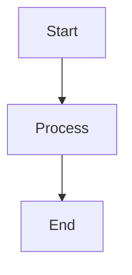

# mermaid-markdown-wrap

[English](README.md) | [日本語](README.ja.md)

`.mmd`や`.mermaid`ファイル（Mermaidダイアグラム）を、MarkdownのコードブロックでラップするミニマルなCLIツールです。デフォルトでは元のファイルを保持します。

## Quick Start

```bash
# グローバルインストール
npm install -g mermaid-markdown-wrap

# 設定ファイルを作成（オプション）
mermaid-markdown-wrap init

# MermaidファイルをMarkdownに変換
mermaid-markdown-wrap diagram.mmd
```

## Features

- ✅ `.mmd`と`.mermaid`ファイルを適切なコードブロックでMarkdownに変換
- ✅ グロブパターンによるバッチ処理
- ✅ 柔軟な設定（YAML、JSON、JavaScript、TypeScript）
- ✅ GitHub Actionsサポート
- ✅ コマンド検証と設定確認ツール

## Usage

### Basic Examples

```bash
# 単一ファイルの変換
mermaid-markdown-wrap diagram.mmd
mermaid-markdown-wrap flowchart.mermaid

# 複数ファイルの変換
mermaid-markdown-wrap "*.mmd"                      # 現在のディレクトリの全ての.mmdファイル
mermaid-markdown-wrap "*.mermaid"                  # 全ての.mermaidファイル
mermaid-markdown-wrap "**/*.{mmd,mermaid}"         # 再帰的に全てのMermaidファイル

# 出力ディレクトリを指定
mermaid-markdown-wrap "src/**/*.mmd" -o dist/      # 出力ディレクトリを指定して変換

# ヘッダー/フッターを追加
mermaid-markdown-wrap "*.mermaid" --header "# Docs"

# 変換後にソースファイルを削除
mermaid-markdown-wrap diagram.mmd --remove-source

# 設定
mermaid-markdown-wrap init                         # 対話的に設定ファイルを作成
mermaid-markdown-wrap -c myconfig.yaml "*.mermaid" # 特定の設定ファイルを使用
mermaid-markdown-wrap config-show                  # 現在の設定を表示
mermaid-markdown-wrap config-show custom.yaml      # 特定のファイルから設定を表示
mermaid-markdown-wrap config-validate              # 設定ファイルを検証
mermaid-markdown-wrap config-validate custom.json  # 特定のファイルを検証
```

### Options

| オプション            | 説明                                    | デフォルト         |
| --------------------- | --------------------------------------- | ------------------ |
| `-o, --out-dir <dir>` | 出力ディレクトリ                        | 入力ファイルと同じ |
| `--header <text>`     | 出力の先頭に追加するテキスト            | -                  |
| `--footer <text>`     | 出力の末尾に追加するテキスト            | -                  |
| `--remove-source`     | ソースファイルを削除                    | `false`            |
| `--hide-command`      | 出力にコマンドを非表示にする            | `false`            |
| `--log-format <format>`| ログ出力形式: text または json         | `text`             |
| `--quiet`             | エラー以外の出力を抑制                  | `false`            |
| `-c, --config <file>` | 設定ファイルのパス                      | 自動検索           |
| `-h, --help`          | ヘルプを表示                            | -                  |
| `-v, --version`       | バージョンを表示                        | -                  |

## Commands

### Convert（デフォルト）

```bash
mermaid-markdown-wrap <input> [options]
```

MermaidファイルをMarkdownに変換します。サブコマンドを指定しない場合のデフォルトコマンドです。

### Config Show

現在の設定を表示:

```bash
# 自動検出された設定を表示
mermaid-markdown-wrap config-show

# 特定の設定ファイルを表示
mermaid-markdown-wrap config-show myconfig.yaml
```

### Config Validate

設定ファイルのエラーをチェック:

```bash
# 自動検出された設定を検証
mermaid-markdown-wrap config-validate

# 特定の設定ファイルを検証
mermaid-markdown-wrap config-validate myconfig.json
```

### Init

設定ファイルを対話的に作成:

```bash
mermaid-markdown-wrap init
```

このコマンドは、以下の項目について順番に質問しながら設定ファイルを作成します:
- 設定ファイル形式（TypeScript、JavaScript、JSON、YAML など）
- 出力ディレクトリ
- ヘッダー/フッターテキスト
- ソースファイルを削除するか
- 出力にコマンドを非表示にするか
- ログ出力形式（text/json）
- エラー以外の出力を抑制するか

## Configuration

ツールは以下の場所から自動的に設定ファイルを検索します（[cosmiconfig](https://github.com/cosmiconfig/cosmiconfig)を使用）：

- `package.json` (`"mermaid-markdown-wrap"`プロパティ)
- `.mermaid-markdown-wraprc` （拡張子なし）
- `.mermaid-markdown-wraprc.{json,yaml,yml,js,ts,mjs,cjs}`
- `.config/mermaid-markdown-wraprc` （拡張子なし）
- `.config/mermaid-markdown-wraprc.{json,yaml,yml,js,ts,mjs,cjs}`
- `mermaid-markdown-wrap.config.{js,ts,mjs,cjs}`

`-c`オプションで設定ファイルを指定することも可能です。

### YAML設定

```yaml
# .mermaid-markdown-wraprc.yaml
outDir: docs
header: "<!-- AUTO-GENERATED -->"
footer: "<!-- END -->"
removeSource: false
hideCommand: false
logFormat: text
quiet: false
```

> **ヒント**: YAMLファイルでIntelliSenseを有効にする方法：
> 
> **オプション1 - VS Code設定** ([YAML拡張機能](https://marketplace.visualstudio.com/items?itemName=redhat.vscode-yaml)を使用)：
> ```json
> // .vscode/settings.json
> {
>   "yaml.schemas": {
>     "https://unpkg.com/mermaid-markdown-wrap/schema/config.schema.json": [
>       ".mermaid-markdown-wraprc",
>       ".mermaid-markdown-wraprc.yaml",
>       ".mermaid-markdown-wraprc.yml",
>       ".config/mermaid-markdown-wraprc",
>       ".config/mermaid-markdown-wraprc.yaml",
>       ".config/mermaid-markdown-wraprc.yml"
>     ]
>   }
> }
> ```
> 
> **オプション2 - YAMLコメント** (一部のエディタでサポート)：
> ```yaml
> # yaml-language-server: $schema=https://unpkg.com/mermaid-markdown-wrap/schema/config.schema.json
> outDir: docs
> ```

### JSON設定（スキーマ付き）

```json
// .mermaid-markdown-wraprc.json
{
  "$schema": "https://unpkg.com/mermaid-markdown-wrap/schema/config.schema.json",
  "outDir": "docs",
  "header": "<!-- AUTO-GENERATED -->",
  "footer": "<!-- END -->",
  "removeSource": false,
  "hideCommand": false,
  "logFormat": "text",
  "quiet": false
}
```

`$schema`プロパティにより、対応エディタでIntelliSense、検証、ホバードキュメントが有効になります。

### JavaScript設定

```javascript
// .mermaid-markdown-wraprc.js

/** @type {import('mermaid-markdown-wrap/config').Config} */
module.exports = {
  outDir: 'docs',
  header: '<!-- AUTO-GENERATED -->',
  footer: '<!-- END -->',
  removeSource: false,
  hideCommand: false,
  logFormat: 'text',
  quiet: false,
};
```

`@type`コメントによりJavaScriptファイルでもIntelliSenseが有効になります。

### TypeScript設定

TypeScript設定を使用する場合は、型定義を取得するためにパッケージをローカルにインストールしてください:

```ts
// mermaid-markdown-wrap.config.ts
import type { Config } from 'mermaid-markdown-wrap/config';

const config: Config = {
  outDir: 'docs',
  header: '<!-- AUTO-GENERATED -->',
  footer: '<!-- END -->',
  removeSource: false,
  hideCommand: false,
  logFormat: 'text',
  quiet: false,
};

export default config;
```

## GitHub Actions

CI/CDパイプラインでこのツールを使用:

```yaml
name: Convert Mermaid Diagrams
on:
  push:
    paths: ["**/*.mmd", "**/*.mermaid"]

jobs:
  convert:
    runs-on: ubuntu-latest
    steps:
      - uses: actions/checkout@v4
      
      - uses: sugurutakahashi-1234/mermaid-markdown-wrap@v1
        with:
          input: "**/*.{mmd,mermaid}"
          out-dir: docs
          remove-source: true
```

### PR Comment Feature

生成されたマークダウンファイルを自動的にPRコメントとして投稿:

```yaml
name: Convert and Comment
on:
  pull_request:
    types: [opened, synchronize]

jobs:
  convert:
    runs-on: ubuntu-latest
    permissions:
      contents: read
      pull-requests: write  # コメント投稿に必要
    steps:
      - uses: actions/checkout@v4
      
      - uses: sugurutakahashi-1234/mermaid-markdown-wrap@v1
        with:
          input: "**/*.{mmd,mermaid}"
          out-dir: docs
          pr-comment-mode: changed  # オプション: 'off', 'changed', 'all'
```

#### PR Comment Options

| オプション | 説明 | デフォルト |
|--------|-------------|---------|
| `pr-comment-mode` | コメント投稿モード: `'off'`, `'changed'`, `'all'` | `'off'` |
| `pr-comment-header` | PRコメントにヘッダーを表示 | `'true'` |
| `pr-comment-details` | PRコメントに折りたたみ可能なdetailsタグを使用 | `'false'` |
| `github-token` | PRコメント用のGitHubトークン | `${{ github.token }}` |

**PRコメントモード:**
- `off` (デフォルト): PRコメントなし
- `changed`: PRで変更されたファイルのみコメント
- `all`: この実行で生成された全ファイルをコメント

**全PRオプションを使用した例:**
```yaml
- uses: sugurutakahashi-1234/mermaid-markdown-wrap@v1
  with:
    input: "**/*.{mmd,mermaid}"
    pr-comment-mode: all
    pr-comment-header: false      # ヘッダーを非表示
    pr-comment-details: true      # コンテンツをdetailsタグで折りたたむ
    github-token: ${{ secrets.GITHUB_TOKEN }}  # カスタムトークン（オプション）
```

**注意:** `pull_request`と`pull_request_target`イベントの両方で動作します。`pull_request_target`を使用する場合は、信頼できないPRコードをチェックアウトしないよう注意してください。

## How It Works

**入力** (`diagram.mmd`):
```
graph TD
  A[Start] --> B[Process]
  B --> C[End]
```

**出力** (`diagram.md`):
````markdown
```bash
mermaid-markdown-wrap diagram.mmd
```


````

## License

MIT