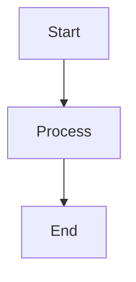

# mermaid-markdown-wrap

[](https://www.npmjs.com/package/mermaid-markdown-wrap)
[](https://www.npmjs.com/package/mermaid-markdown-wrap)
[](https://packagephobia.com/result?p=mermaid-markdown-wrap)
[](https://github.com/sugurutakahashi-1234/mermaid-markdown-wrap/actions/workflows/ci-push-main.yml)
[](https://github.com/sugurutakahashi-1234/mermaid-markdown-wrap/actions/workflows/ci-test-published-package.yml)
[](https://codecov.io/gh/sugurutakahashi-1234/mermaid-markdown-wrap)
[](https://opensource.org/licenses/MIT)
[](https://github.com/sugurutakahashi-1234/mermaid-markdown-wrap/actions/workflows/cd-npm-release.yml)
[](https://github.com/sugurutakahashi-1234/mermaid-markdown-wrap/releases)
[](https://github.com/sugurutakahashi-1234/mermaid-markdown-wrap/pulls)
[](https://github.com/marketplace/actions/mermaid-markdown-wrap)

[English](README.md) | [日本語](README.ja.md)

Mermaidダイアグラムファイル（.mmd/.mermaid）をMarkdownコードブロックでラップ - CLIツール、npmパッケージ、GitHub ActionでGitHub/GitLabでの表示を実現。

## What it does

MermaidファイルをMarkdownコードブロックでラップして、GitHub/GitLab上でダイアグラムとして表示されるようにします。ダイアグラムを個別ファイルで管理しつつ、リポジトリで直接確認できます。

**変換前** (`diagram.mmd`):
```
graph TD
  A[Start] --> B[Process]
  B --> C[End]
```

**実行:**
```bash
mermaid-markdown-wrap diagram.mmd --log-format json
```

**変換後** (`diagram.md`):
````markdown
```bash
mermaid-markdown-wrap diagram.mmd
```


````

## Installation

**必要要件:** Node.js v20以上

```bash
# グローバルインストール（推奨）
npm install -g mermaid-markdown-wrap

# プロジェクト固有のインストール（開発依存関係として）
npm install --save-dev mermaid-markdown-wrap

# または npx で直接使用
npx mermaid-markdown-wrap diagram.mmd
```


## Quick Start

```bash
# すぐにファイルを変換（設定不要）
mermaid-markdown-wrap diagram.mmd
mermaid-markdown-wrap "**/*.{mmd,mermaid}"

# 設定ファイルを生成（任意、-y または --yes でプロンプトをスキップ）
mermaid-markdown-wrap init
```

## Usage

### よくある使用例

1. **ダイアグラムの変換と整理**
   ```bash
   mermaid-markdown-wrap "src/**/*.mmd" --out-dir docs/diagrams
   ```

2. **ドキュメントヘッダーの追加**
   ```bash
   mermaid-markdown-wrap "*.mermaid" --header "# アーキテクチャ図"
   ```

3. **バッチ変換とクリーンアップ**
   ```bash
   mermaid-markdown-wrap "**/*.{mmd,mermaid}" --remove-source
   ```

## Configuration

ツールは以下の場所から自動的に設定ファイルを検索します（[cosmiconfig](https://github.com/cosmiconfig/cosmiconfig#searchplaces)を使用）：
- `package.json` (`"mermaid-markdown-wrap"`プロパティ)
- `.mermaid-markdown-wraprc` (拡張子なし)
- `.mermaid-markdown-wraprc.{json,yaml,yml,js,ts,mjs,cjs}`
- `.config/mermaid-markdown-wraprc` (拡張子なし)
- `.config/mermaid-markdown-wraprc.{json,yaml,yml,js,ts,mjs,cjs}`
- `mermaid-markdown-wrap.config.{js,ts,mjs,cjs}`

### 設定の簡単セットアップ

```bash
# 対話的な設定
mermaid-markdown-wrap init
```

### 設定例

<details>
<summary>JSON設定</summary>

```jsonc
// .mermaid-markdown-wraprc.json
{
  "$schema": "https://unpkg.com/mermaid-markdown-wrap/schema/config.schema.json",
  "outDir": "docs",
  "header": "<!-- AUTO-GENERATED -->",
  "footer": "<!-- END -->"
}
```

</details>

<details>
<summary>YAML設定</summary>

```yaml
# .mermaid-markdown-wraprc.yaml
# yaml-language-server: $schema=https://unpkg.com/mermaid-markdown-wrap/schema/config.schema.json
outDir: docs
header: "<!-- AUTO-GENERATED -->"
footer: "<!-- END -->"
```

</details>

<details>
<summary>JavaScript設定</summary>

#### CommonJS (.js/.cjs)
```js
// mermaid-markdown-wrap.config.js または .mermaid-markdown-wraprc.cjs
const { defineConfig } = require('mermaid-markdown-wrap/config');

module.exports = defineConfig({
  outDir: 'docs',
  header: '<!-- AUTO-GENERATED -->',
  footer: '<!-- END -->'
});
```

#### ES Modules (.mjs)
```js
// mermaid-markdown-wrap.config.mjs
import { defineConfig } from 'mermaid-markdown-wrap/config';

export default defineConfig({
  outDir: 'docs',
  header: '<!-- AUTO-GENERATED -->',
  footer: '<!-- END -->'
});
```

</details>

<details>
<summary>TypeScript設定</summary>

```ts
// mermaid-markdown-wrap.config.ts
import { defineConfig } from 'mermaid-markdown-wrap/config';

export default defineConfig({
  outDir: 'docs',
  header: '<!-- AUTO-GENERATED -->',
  footer: '<!-- END -->'
});
```

</details>

## CLI Reference

### Commands

#### `mermaid-markdown-wrap <input>` (デフォルト)
Mermaidファイルをマークダウンに変換します。

| オプション              | 説明                                   | デフォルト |
| ----------------------- | -------------------------------------- | ---------- |
| `-o, --out-dir <dir>`   | 出力ディレクトリ                       | 入力と同じ |
| `--header <text>`       | 先頭に追加するテキスト                 | -          |
| `--footer <text>`       | 末尾に追加するテキスト                 | -          |
| `--remove-source`       | 変換後にソースファイルを削除           | `false`    |
| `--hide-command`        | 出力ファイルに生成コマンドを表示しない | `false`    |
| `--log-format <format>` | 出力形式（text: 人間が読みやすい、json: CI/CD用の構造化形式） | `text`     |
| `--quiet`               | エラー以外のすべての出力を抑制         | `false`    |
| `-c, --config <file>`   | 設定ファイルのパス                     | 自動検索   |
| `-h, --help`            | ヘルプを表示                           | -          |
| `-v, --version`         | バージョンを表示                       | -          |

#### `mermaid-markdown-wrap init`
対話的に設定ファイルを作成します。

| オプション   | 説明                                         | デフォルト |
| ------------ | -------------------------------------------- | ---------- |
| `-y, --yes`  | プロンプトをスキップしてデフォルト設定を使用 | `false`    |
| `-h, --help` | ヘルプを表示                                 | -          |

#### `mermaid-markdown-wrap config-show [configFile]`
現在の設定を表示します。オプションで設定ファイルのパスを引数として受け取ります。

| オプション   | 説明         | デフォルト |
| ------------ | ------------ | ---------- |
| `-h, --help` | ヘルプを表示 | -          |

#### `mermaid-markdown-wrap config-validate [configFile]`
設定ファイルを検証します。オプションで設定ファイルのパスを引数として受け取ります。

| オプション   | 説明         | デフォルト |
| ------------ | ------------ | ---------- |
| `-h, --help` | ヘルプを表示 | -          |

## GitHub Actions

CI/CDパイプラインでこのツールを使用：

<!-- x-release-please-start-version -->
```yaml
name: Convert Mermaid Diagrams
on:
  push:
    paths: ["**/*.mmd", "**/*.mermaid"]

jobs:
  convert:
    runs-on: ubuntu-latest
    steps:
      - uses: actions/checkout@v4
      
      - uses: sugurutakahashi-1234/mermaid-markdown-wrap@v1.2.1
        with:
          input: "**/*.{mmd,mermaid}"
          out-dir: docs
          remove-source: true
```
<!-- x-release-please-end -->

### Action Inputs

すべてのCLIオプションに加え、GitHub Actions専用のオプションが利用可能：

| Input                    | 説明                                                                                         | デフォルト            |
| ------------------------ | -------------------------------------------------------------------------------------------- | --------------------- |
| `input`                  | ファイルパスまたはグロブパターン（必須）                                                     | -                     |
| `out-dir`                | 出力ディレクトリ                                                                             | 入力と同じ            |
| `header`                 | 先頭に追加するテキスト                                                                       | -                     |
| `footer`                 | 末尾に追加するテキスト                                                                       | -                     |
| `config`                 | 設定ファイルのパス                                                                           | 自動検索              |
| `remove-source`          | 変換後にソースファイルを削除                                                                 | `false`               |
| `hide-command`           | 出力にコマンドを表示しない                                                                   | `false`               |
| **`pr-comment-mode`**    | PRコメントとしてダイアグラムを投稿: `off`, `changed`, `all`                                  | `off`                 |
| **`pr-comment-header`**  | PRコメントにヘッダーを表示                                                                   | `true`                |
| **`pr-comment-details`** | PRコメントを折りたたみ可能にする                                                             | `false`               |
| **`github-token`**       | PRコメント用のGitHubトークン（通常はデフォルトで問題なし；特別な権限が必要な場合のみ上書き） | `${{ github.token }}` |

**注意:** GitHub Actions使用時は、アクション機能との統合を向上させるため、出力形式が自動的にJSONに設定されます（`--log-format json`）。

### 自動PRコメント

変換されたダイアグラムをプルリクエストのコメントとして投稿：

<!-- x-release-please-start-version -->
```yaml
name: Convert and Comment
on:
  pull_request:
    types: [opened, synchronize]

jobs:
  convert:
    runs-on: ubuntu-latest
    permissions:
      contents: read       # リポジトリコンテンツの読み取り
      pull-requests: write # PRへのコメント投稿
    steps:
      - uses: actions/checkout@v4
      
      - uses: sugurutakahashi-1234/mermaid-markdown-wrap@v1.2.1
        with:
          input: "**/*.{mmd,mermaid}"
          pr-comment-mode: changed  # 'off', 'changed', または 'all'
          pr-comment-header: true   # ファイル名付きヘッダーを表示
          pr-comment-details: false # 折りたたみ可能なセクションを使用
```
<!-- x-release-please-end -->

**コメントモード:**
- `off`: コメントなし（デフォルト）
- `changed`: PRで変更されたファイルのみ
- `all`: 変換された全ファイル

**PRコメントの例:**

<details>
<summary>コメント例を表示</summary>

> ### 📄 [mermaid-markdown-wrap](https://github.com/sugurutakahashi-1234/mermaid-markdown-wrap) generated: `diagram.md`
> 
```bash
mermaid-markdown-wrap diagram.mmd
```


</details>

## Contributing

コントリビューションを歓迎します！開発環境のセットアップ、テストガイドライン、プルリクエストの提出方法については[CONTRIBUTING.md](CONTRIBUTING.md)を参照してください。

## Contact

ご質問やフィードバックがある場合は、X/Twitterでご連絡ください: [@ikuraikuraaaaaa](https://twitter.com/ikuraikuraaaaaa)

## License

MIT © [Suguru Takahashi](https://github.com/sugurutakahashi-1234)