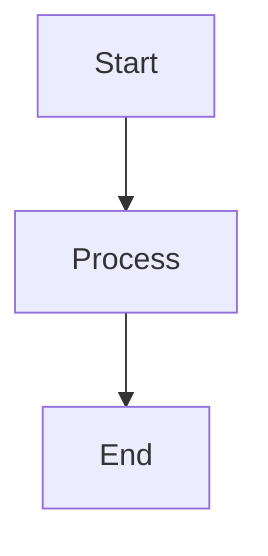

# mermaid-markdown-wrap

`.mmd`ファイル（Mermaidダイアグラム）を元のコンテンツを変更せずにMarkdownコードブロックでラップする最小限のCLIツール。

## Installation

```bash
npm install -g mermaid-markdown-wrap
```

## Usage

```bash
mermaid-markdown-wrap <glob> [options]
```

### Arguments

- `<glob>` - 変換する`.mmd`ファイルのグロブパターン（例: `*.mmd`、`diagrams/**/*.mmd`）

### Options

| オプション            | 説明                         | デフォルト              |
| --------------------- | ---------------------------- | ----------------------- |
| `--out-dir <dir>`     | 出力ディレクトリ             | 入力ファイルと同じ場所  |
| `--extension <ext>`   | 出力ファイルの拡張子         | `.md`                   |
| `--header <text>`     | 出力の先頭に追加するテキスト | なし                    |
| `--footer <text>`     | 出力の末尾に追加するテキスト | なし                    |
| `--glob <pattern>`    | グロブパターンの上書き       | なし                    |
| `-c, --config <file>` | 設定ファイルのパス           | 自動検索                |
| `--print-config`      | マージされた設定を表示       | なし                    |
| `--keep-source`       | ソースの`.mmd`ファイルを保持 | `false`（ソースを削除） |
| `-h, --help`          | ヘルプを表示                 | -                       |
| `-v, --version`       | バージョンを表示             | -                       |

## Examples

### Basic conversion

単一ファイルの変換:
```bash
mermaid-markdown-wrap diagram.mmd
```

複数ファイルの変換:
```bash
mermaid-markdown-wrap "**/*.mmd"
```

### With options

ヘッダーとフッターを追加:
```bash
mermaid-markdown-wrap diagram.mmd --header "# My Diagram" --footer "_Generated on $(date)_"
```

別のディレクトリに出力:
```bash
mermaid-markdown-wrap "src/**/*.mmd" --out-dir docs
```

ソースファイルを保持:
```bash
mermaid-markdown-wrap diagram.mmd --keep-source
```

## Configuration File

`mermaid-markdown-wrap.config.{js,cjs,mjs,json,yml,yaml}`という名前の設定ファイルを作成:

### YAML example
```yaml
outDir: docs
extension: .md
header: |
  <!-- AUTO-GENERATED, DO NOT EDIT -->
footer: |
  _(Generated by mermaid-markdown-wrap)_
keepSource: true
```

### JSON example
```json
{
  "outDir": "docs",
  "extension": ".md",
  "header": "<!-- AUTO-GENERATED -->",
  "footer": "<!-- END -->",
  "keepSource": true
}
```

### JavaScript example
```js
module.exports = {
  outDir: 'docs',
  extension: '.md',
  header: '# Mermaid Diagram',
  footer: `_Generated on ${new Date().toISOString()}_`,
  keepSource: process.env.NODE_ENV === 'development'
};
```

## How it works

1. Mermaidダイアグラム構文を含む`.mmd`ファイルを読み込み
2. コンテンツをMarkdownのmermaidコードブロックでラップ
3. オプションのヘッダー/フッターテキストを追加
4. 指定された拡張子（デフォルト`.md`）で保存
5. オプションでソースの`.mmd`ファイルを削除

### Example transformation

入力（`diagram.mmd`）:
```
graph TD
  A[Start] --> B[Process]
  B --> C[End]
```

出力（`diagram.md`）:
````markdown

````

## Development

```bash
# 依存関係のインストール
bun install

# 開発環境の実行
bun run dev

# テストの実行
bun test

# ビルド
bun run build

# CIチェックの実行
bun run ci
```

## License

MIT