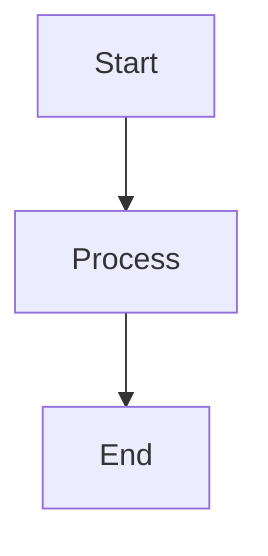

# mermaid-markdown-wrap

[](https://www.npmjs.com/package/mermaid-markdown-wrap)
[](https://www.npmjs.com/package/mermaid-markdown-wrap)
[](https://bundlephobia.com/package/mermaid-markdown-wrap)
[](https://github.com/sugurutakahashi-1234/mermaid-markdown-wrap/actions/workflows/ci-push-main.yml)
[](https://codecov.io/gh/sugurutakahashi-1234/mermaid-markdown-wrap)
[](https://opensource.org/licenses/MIT)
[](https://github.com/sugurutakahashi-1234/mermaid-markdown-wrap/actions/workflows/cd-npm-release.yml)
[](https://github.com/sugurutakahashi-1234/mermaid-markdown-wrap/releases)
[](https://github.com/sugurutakahashi-1234/mermaid-markdown-wrap/pulls)
[](https://github.com/marketplace/actions/mermaid-markdown-wrap)
[](https://github.com/sugurutakahashi-1234/mermaid-markdown-wrap/network/dependents)

[English](README.md) | [日本語](README.ja.md)

Mermaidダイアグラムファイル（.mmd/.mermaid）を適切なコードブロックを含むMarkdownに変換します。ダイアグラムをバージョン管理し、読みやすく保ちます。

## What it does

スタンドアロンのMermaidファイルを、適切にフォーマットされたコードブロックを含むMarkdownファイルに変換：

**変換前** (`diagram.mmd`):
```
graph TD
  A[Start] --> B[Process]
  B --> C[End]
```

**変換後** (`diagram.md`):
````markdown
```bash
mermaid-markdown-wrap diagram.mmd
```


````

## Installation

**必要要件:** Node.js v20以上

```bash
# グローバルインストール（推奨）
npm install -g mermaid-markdown-wrap

# または npx で直接使用
npx mermaid-markdown-wrap diagram.mmd

# 他のパッケージマネージャー
yarn global add mermaid-markdown-wrap
bun add -g mermaid-markdown-wrap
```

## Quick Start

```bash
# 単一ファイルを変換
mermaid-markdown-wrap diagram.mmd

# ディレクトリ内の全Mermaidファイルを変換
mermaid-markdown-wrap "**/*.{mmd,mermaid}"

# 設定ファイルを生成
mermaid-markdown-wrap init
```

## Usage

### よくある使用例

1. **ダイアグラムの変換と整理**
   ```bash
   mermaid-markdown-wrap "src/**/*.mmd" --out-dir docs/diagrams
   ```

2. **ドキュメントヘッダーの追加**
   ```bash
   mermaid-markdown-wrap "*.mermaid" --header "# アーキテクチャ図"
   ```

3. **バッチ変換とクリーンアップ**
   ```bash
   mermaid-markdown-wrap "**/*.{mmd,mermaid}" --remove-source
   ```

4. **設定ファイルを使用**
   ```bash
   mermaid-markdown-wrap init  # 設定ファイルを作成
   mermaid-markdown-wrap "*.mmd"  # 自動的に設定を使用
   ```

## Configuration

ツールは以下の場所から自動的に設定ファイルを検索します：
- `package.json` (`"mermaid-markdown-wrap"`プロパティ)
- `.mermaid-markdown-wraprc{.json,.yaml,.yml,.js,.ts}`
- `.config/mermaid-markdown-wraprc{.json,.yaml,.yml,.js,.ts}`
- `mermaid-markdown-wrap.config.{js,ts}`

### 設定の簡単セットアップ

```bash
# 対話的な設定
mermaid-markdown-wrap init
```

### 設定例

<details>
<summary>YAML設定</summary>

```yaml
# .mermaid-markdown-wraprc.yaml
outDir: docs
header: "<!-- AUTO-GENERATED -->"
footer: "<!-- END -->"
removeSource: false
hideCommand: false
```

</details>

<details>
<summary>JSON設定</summary>

```json
// .mermaid-markdown-wraprc.json
{
  "$schema": "https://unpkg.com/mermaid-markdown-wrap/schema/config.schema.json",
  "outDir": "docs",
  "header": "<!-- AUTO-GENERATED -->",
  "removeSource": false
}
```

</details>

<details>
<summary>TypeScript設定</summary>

```ts
// mermaid-markdown-wrap.config.ts
import { defineConfig } from 'mermaid-markdown-wrap/config';

export default defineConfig({
  outDir: 'docs',
  header: '<!-- AUTO-GENERATED -->',
  removeSource: false
});
```

</details>

### IntelliSenseサポート

VS CodeでYAMLファイルの場合：
```jsonc
// .vscode/settings.json
{
  "yaml.schemas": {
    "https://unpkg.com/mermaid-markdown-wrap/schema/config.schema.json": [
      ".mermaid-markdown-wraprc",
      ".mermaid-markdown-wraprc.yaml",
      ".mermaid-markdown-wraprc.yml"
    ]
  }
}
```

## CLI Reference

### Commands

| コマンド                                       | 説明                                 |
| ---------------------------------------------- | ------------------------------------ |
| `mermaid-markdown-wrap <input>`                | ファイルを変換（デフォルトコマンド） |
| `mermaid-markdown-wrap init`                   | 対話的に設定ファイルを作成           |
| `mermaid-markdown-wrap config-show [file]`     | 現在の設定を表示                     |
| `mermaid-markdown-wrap config-validate [file]` | 設定ファイルを検証                   |

### Options

| オプション              | 説明                           | デフォルト |
| ----------------------- | ------------------------------ | ---------- |
| `-o, --out-dir <dir>`   | 出力ディレクトリ               | 入力と同じ |
| `--header <text>`       | 先頭に追加するテキスト         | -          |
| `--footer <text>`       | 末尾に追加するテキスト         | -          |
| `--remove-source`       | 変換後にソースファイルを削除   | `false`    |
| `--hide-command`        | 出力にコマンドを表示しない     | `false`    |
| `--log-format <format>` | 出力形式: `text` または `json` | `text`     |
| `--quiet`               | エラー以外の出力を抑制         | `false`    |
| `-c, --config <file>`   | 設定ファイルのパス             | 自動検索   |
| `-h, --help`            | ヘルプを表示                   | -          |
| `-v, --version`         | バージョンを表示               | -          |

## GitHub Actions

CI/CDパイプラインでこのツールを使用：

<!-- x-release-please-start-version -->
```yaml
name: Convert Mermaid Diagrams
on:
  push:
    paths: ["**/*.mmd", "**/*.mermaid"]

jobs:
  convert:
    runs-on: ubuntu-latest
    steps:
      - uses: actions/checkout@v4
      
      - uses: sugurutakahashi-1234/mermaid-markdown-wrap@v1.0.0
        with:
          input: "**/*.{mmd,mermaid}"
          out-dir: docs
          remove-source: true
```
<!-- x-release-please-end -->

### Action Inputs

すべてのCLIオプションに加え、GitHub Actions専用のオプションが利用可能：

| Input                    | 説明                                                        | デフォルト            |
| ------------------------ | ----------------------------------------------------------- | --------------------- |
| `input`                  | ファイルパスまたはグロブパターン（必須）                    | -                     |
| `out-dir`                | 出力ディレクトリ                                            | 入力と同じ            |
| `header`                 | 先頭に追加するテキスト                                      | -                     |
| `footer`                 | 末尾に追加するテキスト                                      | -                     |
| `config`                 | 設定ファイルのパス                                          | 自動検索              |
| `remove-source`          | 変換後にソースファイルを削除                                | `false`               |
| `hide-command`           | 出力にコマンドを表示しない                                  | `false`               |
| **`pr-comment-mode`**    | PRコメントとしてダイアグラムを投稿: `off`, `changed`, `all` | `off`                 |
| **`pr-comment-header`**  | PRコメントにヘッダーを表示                                  | `true`                |
| **`pr-comment-details`** | PRコメントを折りたたみ可能にする                            | `false`               |
| **`github-token`**       | PRコメント用のGitHubトークン                                | `${{ github.token }}` |

<details>
<summary>PRコメント機能</summary>

### 自動PRコメント

変換されたダイアグラムをプルリクエストのコメントとして投稿：

<!-- x-release-please-start-version -->
```yaml
name: Convert and Comment
on:
  pull_request:
    types: [opened, synchronize]

jobs:
  convert:
    runs-on: ubuntu-latest
    permissions:
      contents: read
      pull-requests: write
    steps:
      - uses: actions/checkout@v4
      
      - uses: sugurutakahashi-1234/mermaid-markdown-wrap@v1.0.0
        with:
          input: "**/*.{mmd,mermaid}"
          pr-comment-mode: changed  # 'off', 'changed', または 'all'
          pr-comment-header: true
          pr-comment-details: false
```
<!-- x-release-please-end -->

**コメントモード:**
- `off`: コメントなし（デフォルト）
- `changed`: PRで変更されたファイルのみ
- `all`: 変換された全ファイル

</details>

## Contributing

コントリビューションを歓迎します！開発環境のセットアップ、テストガイドライン、プルリクエストの提出方法については[CONTRIBUTING.md](CONTRIBUTING.md)を参照してください。

## Contact

ご質問やフィードバックがある場合は、X/Twitterでご連絡ください: [@ikuraikuraaaaaa](https://twitter.com/ikuraikuraaaaaa)

## License

MIT © [Suguru Takahashi](https://github.com/sugurutakahashi-1234)