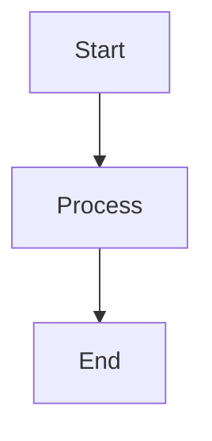

# mermaid-markdown-wrap

[English](README.md) | [日本語](README.ja.md)

A minimal CLI tool to wrap `.mmd` and `.mermaid` files (Mermaid diagrams) in Markdown code blocks without modifying the original content.

## Quick Start

```bash
# Install globally
npm install -g mermaid-markdown-wrap

# Convert a Mermaid file to Markdown
mermaid-markdown-wrap diagram.mmd
```

## Features

- ✅ Convert `.mmd` and `.mermaid` files to Markdown with proper code blocks
- ✅ Batch processing with glob patterns
- ✅ Flexible configuration (YAML, JSON, JavaScript, TypeScript)
- ✅ GitHub Actions support
- ✅ Command validation and configuration inspection tools

## Usage

### Basic Examples

```bash
# Convert a single file
mermaid-markdown-wrap diagram.mmd

# Convert multiple files
mermaid-markdown-wrap "**/*.mmd"

# Specify output directory
mermaid-markdown-wrap "src/**/*.{mmd,mermaid}" --out-dir docs

# Keep source files after conversion
mermaid-markdown-wrap diagram.mmd --keep-source
```

### Options

| Option                | Description                   | Default            |
| --------------------- | ----------------------------- | ------------------ |
| `-o, --out-dir <dir>` | Output directory              | Same as input      |
| `--extension <ext>`   | Output file extension         | `.md`              |
| `--header <text>`     | Text to prepend to output     | -                  |
| `--footer <text>`     | Text to append to output      | -                  |
| `--keep-source`       | Keep source files             | `false`            |
| `--no-show-command`   | Hide command in output        | `false`            |
| `-c, --config <file>` | Config file path              | Auto-search        |
| `-h, --help`          | Show help                     | -                  |
| `-v, --version`       | Show version                  | -                  |

## Commands

### Convert (default)

```bash
mermaid-markdown-wrap <glob> [options]
```

Converts Mermaid files to Markdown. This is the default command when no subcommand is specified.

### Config Show

Display the current configuration:

```bash
# Show auto-discovered config
mermaid-markdown-wrap config-show

# Show specific config file
mermaid-markdown-wrap config-show myconfig.yaml
```

### Config Validate

Check configuration files for errors:

```bash
# Validate auto-discovered config
mermaid-markdown-wrap config-validate

# Validate specific config file
mermaid-markdown-wrap config-validate myconfig.json
```

## Configuration

The tool automatically searches for configuration files in the following locations (powered by [cosmiconfig](https://github.com/cosmiconfig/cosmiconfig)):

- `package.json` (`"mermaid-markdown-wrap"` property)
- `.mermaid-markdown-wraprc` (no extension)
- `.mermaid-markdown-wraprc.{json,yaml,yml,js,ts,mjs,cjs}`
- `.config/mermaid-markdown-wraprc` (no extension)
- `.config/mermaid-markdown-wraprc.{json,yaml,yml,js,ts,mjs,cjs}`
- `mermaid-markdown-wrap.config.{js,ts,mjs,cjs}`

You can also specify a config file using the `-c` option.

### YAML Configuration

```yaml
# .mermaid-markdown-wraprc.yaml
outDir: docs
extension: .md
header: |
  <!-- AUTO-GENERATED, DO NOT EDIT -->
footer: |
  _(Generated by mermaid-markdown-wrap)_
keepSource: true
```

> **Tip**: To enable IntelliSense for YAML files:
> 
> **Option 1 - VS Code Settings** (with [YAML extension](https://marketplace.visualstudio.com/items?itemName=redhat.vscode-yaml)):
> ```json
> // .vscode/settings.json
> {
>   "yaml.schemas": {
>     "https://unpkg.com/mermaid-markdown-wrap/schema/config.schema.json": [
>       ".mermaid-markdown-wraprc",
>       ".mermaid-markdown-wraprc.yaml",
>       ".mermaid-markdown-wraprc.yml",
>       ".config/mermaid-markdown-wraprc",
>       ".config/mermaid-markdown-wraprc.yaml",
>       ".config/mermaid-markdown-wraprc.yml"
>     ]
>   }
> }
> ```
> 
> **Option 2 - YAML Comment** (supported by some editors):
> ```yaml
> # yaml-language-server: $schema=https://unpkg.com/mermaid-markdown-wrap/schema/config.schema.json
> outDir: docs
> extension: .md
> ```

### JSON Configuration (with Schema)

```json
// .mermaid-markdown-wraprc.json
{
  "$schema": "https://unpkg.com/mermaid-markdown-wrap/schema/config.schema.json",
  "outDir": "docs",
  "extension": ".md",
  "header": "<!-- AUTO-GENERATED -->",
  "footer": "<!-- END -->",
  "keepSource": true
}
```

The `$schema` property enables IntelliSense, validation, and hover documentation in supported editors.

For TypeScript configurations, install the package locally to get type definitions:

```ts
// mermaid-markdown-wrap.config.ts
import type { Config } from 'mermaid-markdown-wrap/config';

const config: Config = {
  outDir: 'docs',
  extension: '.md',
  keepSource: false,
};

export default config;
```

## GitHub Actions

Use this tool in your CI/CD pipelines:

```yaml
name: Convert Mermaid Diagrams
on:
  push:
    paths: ["**/*.mmd", "**/*.mermaid"]

jobs:
  convert:
    runs-on: ubuntu-latest
    steps:
      - uses: actions/checkout@v4
      
      - uses: sugurutakahashi-1234/mermaid-markdown-wrap@v1
        with:
          pattern: "**/*.{mmd,mermaid}"
          out-dir: docs
          keep-source: true
```

## How It Works

**Input** (`diagram.mmd`):
```
graph TD
  A[Start] --> B[Process]
  B --> C[End]
```

**Output** (`diagram.md`):
````markdown
```bash
mermaid-markdown-wrap diagram.mmd
```


````

## License

MIT