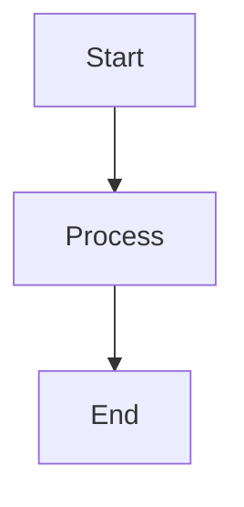

# mermaid-markdown-wrap

A minimal CLI tool to wrap `.mmd` and `.mermaid` files (Mermaid diagrams) in Markdown code blocks without modifying the original content.

## Supported File Formats

- **Input**: `.mmd`, `.mermaid` - Plain text files containing Mermaid diagram syntax
- **Output**: `.md` (default) - Markdown files with mermaid code blocks
- **Config**: `.json`, `.yaml`, `.yml`, `.js`, `.ts`, `.mjs`, `.cjs` - Configuration files

## Installation

```bash
npm install -g mermaid-markdown-wrap
```

## Usage

```bash
mermaid-markdown-wrap <glob> [options]
```

### Arguments

- `<glob>` - Glob pattern for Mermaid files to convert (e.g., `*.mmd`, `*.mermaid`, `**/*.{mmd,mermaid}`)

### Options

CLI arguments take precedence over config file settings.

| Option                | Description                         | Default                  |
| --------------------- | ----------------------------------- | ------------------------ |
| `-o, --out-dir <dir>` | Output directory                    | Same as input file       |
| `--extension <ext>`   | Output file extension               | `.md`                    |
| `--header <text>`     | Text to prepend to output           | None                     |
| `--footer <text>`     | Text to append to output            | None                     |
| `--glob <pattern>`    | Override glob pattern               | None                     |
| `-c, --config <file>` | Config file path                    | Auto-search              |
| `--keep-source`       | Keep source `.mmd`/`.mermaid` files | `false` (deletes source) |
| `--no-show-command`   | Hide the command used in output     | `false` (shows command)  |
| `-h, --help`          | Show help                           | -                        |
| `-v, --version`       | Show version                        | -                        |

## Examples

### Basic conversion

Convert a single file:
```bash
mermaid-markdown-wrap diagram.mmd
mermaid-markdown-wrap flowchart.mermaid
```

Convert multiple files:
```bash
mermaid-markdown-wrap "**/*.mmd"
mermaid-markdown-wrap "**/*.mermaid"
mermaid-markdown-wrap "**/*.{mmd,mermaid}"  # Both extensions
```

### With options

Add header and footer:
```bash
mermaid-markdown-wrap diagram.mmd --header "# My Diagram" --footer "_Generated on $(date)_"
```

Output to different directory:
```bash
mermaid-markdown-wrap "src/**/*.{mmd,mermaid}" --out-dir docs
```

Keep source files:
```bash
mermaid-markdown-wrap diagram.mmd --keep-source
```

Hide command information in output:
```bash
mermaid-markdown-wrap diagram.mmd --no-show-command
```

## Configuration Commands

### Show Configuration

Display the current configuration (merged from all sources):

```bash
# Show configuration from default locations
mermaid-markdown-wrap config-show

# Show configuration from a specific file
mermaid-markdown-wrap config-show custom.yaml
```

### Validate Configuration

Check your configuration file for errors:

```bash
# Search for and validate config in default locations
mermaid-markdown-wrap config-validate

# Validate a specific config file
mermaid-markdown-wrap config-validate myconfig.json
mermaid-markdown-wrap config-validate myconfig.yaml
mermaid-markdown-wrap config-validate myconfig.ts
```

## Configuration File

Create a configuration file. The tool searches for config files in the following order:

1. `.mermaid-markdown-wraprc` (no extension)
2. `.mermaid-markdown-wraprc.{json,yaml,yml,js,ts,mjs,cjs}`
3. `mermaid-markdown-wrap.config.{js,ts,mjs,cjs}`
4. `.config/mermaid-markdown-wraprc.*` (in .config subdirectory)
5. `"mermaid-markdown-wrap"` property in package.json

> **Note**: CLI arguments override config file settings.

### YAML example
```yaml
outDir: docs
extension: .md
header: |
  <!-- AUTO-GENERATED, DO NOT EDIT -->
footer: |
  _(Generated by mermaid-markdown-wrap)_
keepSource: true
showCommand: true  # Show command used in output (default: true)
```

### JSON example
```json
{
  "outDir": "docs",
  "extension": ".md",
  "header": "<!-- AUTO-GENERATED -->",
  "footer": "<!-- END -->",
  "keepSource": true,
  "showCommand": true
}
```

### JavaScript example
```js
module.exports = {
  outDir: 'docs',
  extension: '.md',
  header: '# Mermaid Diagram',
  footer: `_Generated on ${new Date().toISOString()}_`,
  keepSource: process.env.NODE_ENV === 'development',
  showCommand: true
};
```

### TypeScript example
```ts
import type { Config } from 'mermaid-markdown-wrap/config';

const config: Config = {
  outDir: 'docs',
  extension: '.md',
  header: '<!-- AUTO-GENERATED -->',
  footer: '<!-- END -->',
  keepSource: false,
  showCommand: true,
};

export default config;
```

## How it works

1. Reads `.mmd` or `.mermaid` files containing Mermaid diagram syntax
2. Wraps the content in a Markdown mermaid code block
3. Adds optional header/footer text
4. Saves with the specified extension (default `.md`)
5. Optionally deletes the source `.mmd`/`.mermaid` file

### Example transformation

Input (`diagram.mmd` or `diagram.mermaid`):
```
graph TD
  A[Start] --> B[Process]
  B --> C[End]
```

Output (`diagram.md`):
````markdown
```bash
mermaid-markdown-wrap diagram.mmd
```


````

## GitHub Actions

You can use this tool directly in GitHub Actions workflows:

### Basic Usage

```yaml
name: Wrap Mermaid
on:
  push:
    paths: ["**/*.mmd", "**/*.mermaid"]

jobs:
  wrap:
    runs-on: ubuntu-latest
    steps:
      - uses: actions/checkout@v4
      
      - uses: sugurutakahashi-1234/mermaid-markdown-wrap@v1
        with:
          pattern: "**/*.{mmd,mermaid}"
```

### Available Inputs

All CLI options are available as action inputs:

| Input         | Description                    | Required | Default       |
| ------------- | ------------------------------ | -------- | ------------- |
| `pattern`     | Glob pattern for Mermaid files | **Yes**  | -             |
| `out-dir`     | Output directory               | No       | Same as input |
| `extension`   | Output file extension          | No       | `.md`         |
| `header`      | Text to prepend to output      | No       | -             |
| `footer`      | Text to append to output       | No       | -             |
| `glob`        | Override glob pattern          | No       | -             |
| `config`      | Config file path               | No       | Auto-search   |
| `keep-source` | Keep source files              | No       | `false`       |
| `show-command` | Show command in output         | No       | `true`        |

### Advanced Examples

#### With all options
```yaml
- uses: sugurutakahashi-1234/mermaid-markdown-wrap@v1
  with:
    pattern: "diagrams/**/*.mmd"
    out-dir: docs/diagrams
    extension: .markdown
    header: |
      <!-- AUTO-GENERATED: DO NOT EDIT -->
      <!-- Source: ${{ github.repository }} -->
    footer: |
      ---
      _Generated on ${{ github.event.head_commit.timestamp }}_
    keep-source: true
```

#### Using configuration file
```yaml
- uses: sugurutakahashi-1234/mermaid-markdown-wrap@v1
  with:
    pattern: "**/*.mermaid"
    config: .github/mermaid-config.yaml
```

#### Multiple directories with matrix
```yaml
strategy:
  matrix:
    dir: [frontend, backend, docs]
steps:
  - uses: actions/checkout@v4
  
  - uses: sugurutakahashi-1234/mermaid-markdown-wrap@v1
    with:
      pattern: "${{ matrix.dir }}/**/*.{mmd,mermaid}"
      out-dir: "generated/${{ matrix.dir }}"
```

#### Commit generated files
```yaml
- uses: actions/checkout@v4

- uses: sugurutakahashi-1234/mermaid-markdown-wrap@v1
  with:
    pattern: "**/*.mmd"
    keep-source: true

- name: Commit changes
  run: |
    git config user.name "github-actions[bot]"
    git config user.email "github-actions[bot]@users.noreply.github.com"
    git add -A
    git diff --staged --quiet || git commit -m "docs: auto-generate markdown from mermaid files"
    git push
```

## License

MIT