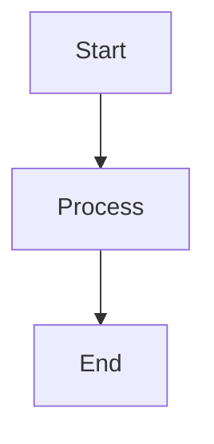

# mermaid-markdown-wrap

[](https://www.npmjs.com/package/mermaid-markdown-wrap)
[](https://opensource.org/licenses/MIT)
[](https://nodejs.org/)

[English](README.md) | [日本語](README.ja.md)

Convert Mermaid diagram files (.mmd/.mermaid) to Markdown with proper code blocks. Keep your diagrams version-controlled and readable.

## What it does

Transforms standalone Mermaid files into Markdown files with properly formatted code blocks:

**Before** (`diagram.mmd`):
```
graph TD
  A[Start] --> B[Process]
  B --> C[End]
```

**After** (`diagram.md`):
````markdown
```bash
mermaid-markdown-wrap diagram.mmd
```


````

## Installation

**Requirements:** Node.js v20 or higher

```bash
# Global installation (recommended)
npm install -g mermaid-markdown-wrap

# Or use directly with npx
npx mermaid-markdown-wrap diagram.mmd

# Alternative package managers
yarn global add mermaid-markdown-wrap
bun add -g mermaid-markdown-wrap
```

## Quick Start

```bash
# Convert a single file
mermaid-markdown-wrap diagram.mmd

# Convert all Mermaid files in a directory
mermaid-markdown-wrap "**/*.{mmd,mermaid}"

# Generate a configuration file
mermaid-markdown-wrap init
```

## Usage

### Common Use Cases

1. **Convert and organize diagrams**
   ```bash
   mermaid-markdown-wrap "src/**/*.mmd" --out-dir docs/diagrams
   ```

2. **Add documentation headers**
   ```bash
   mermaid-markdown-wrap "*.mermaid" --header "# Architecture Diagrams"
   ```

3. **Batch conversion with cleanup**
   ```bash
   mermaid-markdown-wrap "**/*.{mmd,mermaid}" --remove-source
   ```

4. **Use with configuration file**
   ```bash
   mermaid-markdown-wrap init  # Create config file
   mermaid-markdown-wrap "*.mmd"  # Uses config automatically
   ```

## Configuration

The tool automatically searches for configuration files in these locations:
- `package.json` (`"mermaid-markdown-wrap"` property)
- `.mermaid-markdown-wraprc{.json,.yaml,.yml,.js,.ts}`
- `.config/mermaid-markdown-wraprc{.json,.yaml,.yml,.js,.ts}`
- `mermaid-markdown-wrap.config.{js,ts}`

### Quick Configuration Setup

```bash
# Interactive configuration
mermaid-markdown-wrap init
```

### Configuration Examples

<details>
<summary>YAML Configuration</summary>

```yaml
# .mermaid-markdown-wraprc.yaml
outDir: docs
header: "<!-- AUTO-GENERATED -->"
footer: "<!-- END -->"
removeSource: false
hideCommand: false
```

</details>

<details>
<summary>JSON Configuration</summary>

```json
// .mermaid-markdown-wraprc.json
{
  "$schema": "https://unpkg.com/mermaid-markdown-wrap/schema/config.schema.json",
  "outDir": "docs",
  "header": "<!-- AUTO-GENERATED -->",
  "removeSource": false
}
```

</details>

<details>
<summary>TypeScript Configuration</summary>

```ts
// mermaid-markdown-wrap.config.ts
import { defineConfig } from 'mermaid-markdown-wrap/config';

export default defineConfig({
  outDir: 'docs',
  header: '<!-- AUTO-GENERATED -->',
  removeSource: false
});
```

</details>

### IntelliSense Support

For YAML files with VS Code:
```json
// .vscode/settings.json
{
  "yaml.schemas": {
    "https://unpkg.com/mermaid-markdown-wrap/schema/config.schema.json": [
      ".mermaid-markdown-wraprc",
      ".mermaid-markdown-wraprc.yaml",
      ".mermaid-markdown-wraprc.yml"
    ]
  }
}
```

## CLI Reference

### Commands

| Command | Description |
|---------|-------------|
| `mermaid-markdown-wrap <input>` | Convert files (default command) |
| `mermaid-markdown-wrap init` | Create configuration file interactively |
| `mermaid-markdown-wrap config-show [file]` | Display current configuration |
| `mermaid-markdown-wrap config-validate [file]` | Validate configuration file |

### Options

| Option | Description | Default |
|--------|-------------|---------|
| `-o, --out-dir <dir>` | Output directory | Same as input |
| `--header <text>` | Text to prepend | - |
| `--footer <text>` | Text to append | - |
| `--remove-source` | Remove source files after conversion | `false` |
| `--hide-command` | Hide command in output | `false` |
| `--log-format <format>` | Output format: `text` or `json` | `text` |
| `--quiet` | Suppress non-error output | `false` |
| `-c, --config <file>` | Config file path | Auto-search |
| `-h, --help` | Show help | - |
| `-v, --version` | Show version | - |

## GitHub Actions

Use this tool in your CI/CD pipelines:

```yaml
name: Convert Mermaid Diagrams
on:
  push:
    paths: ["**/*.mmd", "**/*.mermaid"]

jobs:
  convert:
    runs-on: ubuntu-latest
    steps:
      - uses: actions/checkout@v4
      
      - uses: sugurutakahashi-1234/mermaid-markdown-wrap@v1
        with:
          input: "**/*.{mmd,mermaid}"
          out-dir: docs
          remove-source: true
```

### Action Inputs

All CLI options are available, plus GitHub Actions-specific options:

| Input | Description | Default |
|-------|-------------|---------|
| `input` | File path or glob pattern (required) | - |
| `out-dir` | Output directory | Same as input |
| `header` | Header text to prepend | - |
| `footer` | Footer text to append | - |
| `config` | Config file path | Auto-search |
| `remove-source` | Remove source files after conversion | `false` |
| `hide-command` | Hide command in output | `false` |
| **`pr-comment-mode`** | Post diagrams as PR comments: `off`, `changed`, `all` | `off` |
| **`pr-comment-header`** | Show header in PR comments | `true` |
| **`pr-comment-details`** | Use collapsible details for PR comments | `false` |
| **`github-token`** | GitHub token for PR comments | `${{ github.token }}` |

<details>
<summary>PR Comment Feature</summary>

### Automatic PR Comments

Post converted diagrams as comments on pull requests:

```yaml
name: Convert and Comment
on:
  pull_request:
    types: [opened, synchronize]

jobs:
  convert:
    runs-on: ubuntu-latest
    permissions:
      contents: read
      pull-requests: write
    steps:
      - uses: actions/checkout@v4
      
      - uses: sugurutakahashi-1234/mermaid-markdown-wrap@v1
        with:
          input: "**/*.{mmd,mermaid}"
          pr-comment-mode: changed  # 'off', 'changed', or 'all'
          pr-comment-header: true
          pr-comment-details: false
```

**Comment Modes:**
- `off`: No comments (default)
- `changed`: Only files changed in the PR
- `all`: All converted files

</details>

## Contributing

We welcome contributions! For development setup, testing guidelines, and how to submit pull requests, see [CONTRIBUTING.md](CONTRIBUTING.md).

## Contact

If you have any questions or feedback, you can reach me on X/Twitter: [@ikuraikuraaaaaa](https://twitter.com/ikuraikuraaaaaa)

## License

MIT © [Suguru Takahashi](https://github.com/sugurutakahashi-1234)