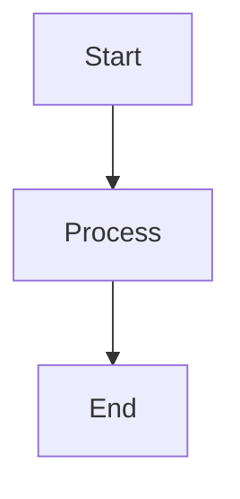

# mermaid-markdown-wrap

[](https://www.npmjs.com/package/mermaid-markdown-wrap)
[](https://www.npmjs.com/package/mermaid-markdown-wrap)
[](https://bundlephobia.com/package/mermaid-markdown-wrap)
[](https://github.com/sugurutakahashi-1234/mermaid-markdown-wrap/actions/workflows/ci-push-main.yml)
[](https://github.com/sugurutakahashi-1234/mermaid-markdown-wrap/actions/workflows/ci-test-published-package.yml)
[](https://codecov.io/gh/sugurutakahashi-1234/mermaid-markdown-wrap)
[](https://opensource.org/licenses/MIT)
[](https://github.com/sugurutakahashi-1234/mermaid-markdown-wrap/actions/workflows/cd-npm-release.yml)
[](https://github.com/sugurutakahashi-1234/mermaid-markdown-wrap/releases)
[](https://github.com/sugurutakahashi-1234/mermaid-markdown-wrap/pulls)
[](https://github.com/marketplace/actions/mermaid-markdown-wrap)
[](https://github.com/sugurutakahashi-1234/mermaid-markdown-wrap/network/dependents)

[English](README.md) | [日本語](README.ja.md)

Convert Mermaid diagram files (.mmd/.mermaid) to Markdown with proper code blocks. Keep your diagrams version-controlled and readable.

## What it does

Transforms standalone Mermaid files into Markdown files with properly formatted code blocks:

**Before** (`diagram.mmd`):
```
graph TD
  A[Start] --> B[Process]
  B --> C[End]
```

**Run:**
```bash
mermaid-markdown-wrap diagram.mmd
```

**After** (`diagram.md`):
````markdown
```bash
mermaid-markdown-wrap diagram.mmd
```


````

## Installation

**Requirements:** Node.js v20 or higher

```bash
# Global installation (recommended)
npm install -g mermaid-markdown-wrap

# Project-specific installation (as dev dependency)
npm install --save-dev mermaid-markdown-wrap

# Or use directly with npx
npx mermaid-markdown-wrap diagram.mmd
```

**Alternative package managers:** Also compatible with yarn, bun, and pnpm

## Quick Start

```bash
# Generate a configuration file (optional but recommended, use -y or --yes to skip prompts)
mermaid-markdown-wrap init

# Convert files (single file or glob pattern)
mermaid-markdown-wrap diagram.mmd
mermaid-markdown-wrap "**/*.{mmd,mermaid}"
```

## Usage

### Common Use Cases

1. **Convert and organize diagrams**
   ```bash
   mermaid-markdown-wrap "src/**/*.mmd" --out-dir docs/diagrams
   ```

2. **Add documentation headers**
   ```bash
   mermaid-markdown-wrap "*.mermaid" --header "# Architecture Diagrams"
   ```

3. **Batch conversion with cleanup**
   ```bash
   mermaid-markdown-wrap "**/*.{mmd,mermaid}" --remove-source
   ```

## Configuration

The tool automatically searches for configuration files in these locations (powered by [cosmiconfig](https://github.com/cosmiconfig/cosmiconfig#searchplaces)):
- `package.json` (`"mermaid-markdown-wrap"` property)
- `.mermaid-markdown-wraprc` (no extension)
- `.mermaid-markdown-wraprc.{json,yaml,yml,js,ts,mjs,cjs}`
- `.config/mermaid-markdown-wraprc` (no extension)
- `.config/mermaid-markdown-wraprc.{json,yaml,yml,js,ts,mjs,cjs}`
- `mermaid-markdown-wrap.config.{js,ts,mjs,cjs}`

### Quick Configuration Setup

```bash
# Interactive configuration
mermaid-markdown-wrap init
```

### Configuration Examples

<details>
<summary>YAML Configuration</summary>

```yaml
# .mermaid-markdown-wraprc.yaml
outDir: docs
header: "<!-- AUTO-GENERATED -->"
footer: "<!-- END -->"
```

### IntelliSense Support

For YAML files with VS Code:
```jsonc
// .vscode/settings.json
{
  "yaml.schemas": {
    "https://unpkg.com/mermaid-markdown-wrap/schema/config.schema.json": [
      ".mermaid-markdown-wraprc",
      ".mermaid-markdown-wraprc.yaml",
      ".mermaid-markdown-wraprc.yml"
    ]
  }
}
```

</details>

<details>
<summary>JSON Configuration</summary>

```jsonc
// .mermaid-markdown-wraprc.json
{
  "$schema": "https://unpkg.com/mermaid-markdown-wrap/schema/config.schema.json",
  "outDir": "docs",
  "header": "<!-- AUTO-GENERATED -->",
  "footer": "<!-- END -->"
}
```

</details>

<details>
<summary>JavaScript Configuration</summary>

#### CommonJS (.js/.cjs)
```js
// .mermaid-markdown-wraprc.js or .mermaid-markdown-wraprc.cjs
module.exports = {
  outDir: 'docs',
  header: '<!-- AUTO-GENERATED -->',
  footer: '<!-- END -->'
};
```

#### ES Modules (.mjs)
```js
// mermaid-markdown-wrap.config.mjs
export default {
  outDir: 'docs',
  header: '<!-- AUTO-GENERATED -->',
  footer: '<!-- END -->'
};
```

#### With defineConfig helper
```js
// mermaid-markdown-wrap.config.js
const { defineConfig } = require('mermaid-markdown-wrap/config');

module.exports = defineConfig({
  outDir: 'docs',
  header: '<!-- AUTO-GENERATED -->',
  footer: '<!-- END -->'
});
```

</details>

<details>
<summary>TypeScript Configuration</summary>

```ts
// mermaid-markdown-wrap.config.ts
import { defineConfig } from 'mermaid-markdown-wrap/config';

export default defineConfig({
  outDir: 'docs',
  header: '<!-- AUTO-GENERATED -->',
  footer: '<!-- END -->'
});
```

</details>

## CLI Reference

### Commands

#### `mermaid-markdown-wrap <input>` (default)
Convert Mermaid files to Markdown.

| Option                  | Description                             | Default       |
| ----------------------- | --------------------------------------- | ------------- |
| `-o, --out-dir <dir>`   | Output directory                        | Same as input |
| `--header <text>`       | Text to prepend                         | -             |
| `--footer <text>`       | Text to append                          | -             |
| `--remove-source`       | Remove source files after conversion    | `false`       |
| `--hide-command`        | Hide generation command in output files | `false`       |
| `--log-format <format>` | Output format: `text` or `json`         | `text`        |
| `--quiet`               | Suppress non-error output               | `false`       |
| `-c, --config <file>`   | Config file path                        | Auto-search   |
| `-h, --help`            | Show help                               | -             |
| `-v, --version`         | Show version                            | -             |

#### `mermaid-markdown-wrap init`
Create configuration file interactively.

| Option       | Description                           | Default |
| ------------ | ------------------------------------- | ------- |
| `-y, --yes`  | Skip prompts and use default settings | `false` |
| `-h, --help` | Show help                             | -       |

#### `mermaid-markdown-wrap config-show [configFile]`
Display current configuration. Takes an optional config file path argument.

| Option       | Description | Default |
| ------------ | ----------- | ------- |
| `-h, --help` | Show help   | -       |

#### `mermaid-markdown-wrap config-validate [configFile]`
Validate configuration file. Takes an optional config file path argument.

| Option       | Description | Default |
| ------------ | ----------- | ------- |
| `-h, --help` | Show help   | -       |

## GitHub Actions

Use this tool in your CI/CD pipelines:

<!-- x-release-please-start-version -->
```yaml
name: Convert Mermaid Diagrams
on:
  push:
    paths: ["**/*.mmd", "**/*.mermaid"]

jobs:
  convert:
    runs-on: ubuntu-latest
    steps:
      - uses: actions/checkout@v4
      
      - uses: sugurutakahashi-1234/mermaid-markdown-wrap@v1.1.0
        with:
          input: "**/*.{mmd,mermaid}"
          out-dir: docs
          remove-source: true
```
<!-- x-release-please-end -->

### Action Inputs

All CLI options are available, plus GitHub Actions-specific options:

| Input                    | Description                                                                                            | Default               |
| ------------------------ | ------------------------------------------------------------------------------------------------------ | --------------------- |
| `input`                  | File path or glob pattern (required)                                                                   | -                     |
| `out-dir`                | Output directory                                                                                       | Same as input         |
| `header`                 | Header text to prepend                                                                                 | -                     |
| `footer`                 | Footer text to append                                                                                  | -                     |
| `config`                 | Config file path                                                                                       | Auto-search           |
| `remove-source`          | Remove source files after conversion                                                                   | `false`               |
| `hide-command`           | Hide command in output                                                                                 | `false`               |
| **`pr-comment-mode`**    | Post diagrams as PR comments: `off`, `changed`, `all`                                                  | `off`                 |
| **`pr-comment-header`**  | Show header in PR comments                                                                             | `true`                |
| **`pr-comment-details`** | Use collapsible details for PR comments                                                                | `false`               |
| **`github-token`**       | GitHub token for PR comments (usually default is fine; override only if you need specific permissions) | `${{ github.token }}` |

### Automatic PR Comments

Post converted diagrams as comments on pull requests:

<!-- x-release-please-start-version -->
```yaml
name: Convert and Comment
on:
  pull_request:
    types: [opened, synchronize]

jobs:
  convert:
    runs-on: ubuntu-latest
    permissions:
      contents: read # Required for PR comments
      pull-requests: write # Required for PR comments
    steps:
      - uses: actions/checkout@v4
      
      - uses: sugurutakahashi-1234/mermaid-markdown-wrap@v1.1.0
        with:
          input: "**/*.{mmd,mermaid}"
          pr-comment-mode: changed  # 'off', 'changed', or 'all'
          pr-comment-header: true
          pr-comment-details: false
```
<!-- x-release-please-end -->

**Comment Modes:**
- `off`: No comments (default)
- `changed`: Only files changed in the PR
- `all`: All converted files

**Example PR Comment:**

<details>
<summary>View example comment</summary>

> ### 📄 [mermaid-markdown-wrap](https://github.com/sugurutakahashi-1234/mermaid-markdown-wrap) generated: `diagram.md`
> 
```bash
mermaid-markdown-wrap diagram.mmd
```


</details>

## Contributing

We welcome contributions! For development setup, testing guidelines, and how to submit pull requests, see [CONTRIBUTING.md](CONTRIBUTING.md).

## Contact

If you have any questions or feedback, you can reach me on X/Twitter: [@ikuraikuraaaaaa](https://twitter.com/ikuraikuraaaaaa)

## License

MIT © [Suguru Takahashi](https://github.com/sugurutakahashi-1234)