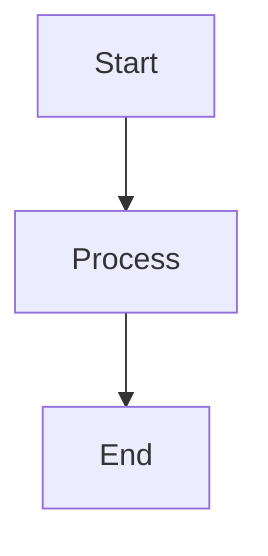

# mermaid-markdown-wrap

A minimal CLI tool to wrap `.mmd` and `.mermaid` files (Mermaid diagrams) in Markdown code blocks without modifying the original content.

## Installation

```bash
npm install -g mermaid-markdown-wrap
```

## Usage

```bash
mermaid-markdown-wrap <glob> [options]
```

### Arguments

- `<glob>` - Glob pattern for Mermaid files to convert (e.g., `*.mmd`, `*.mermaid`, `**/*.{mmd,mermaid}`)

### Options

| Option | Description | Default |
|--------|-------------|---------|
| `--out-dir <dir>` | Output directory | Same as input file |
| `--extension <ext>` | Output file extension | `.md` |
| `--header <text>` | Text to prepend to output | None |
| `--footer <text>` | Text to append to output | None |
| `--glob <pattern>` | Override glob pattern | None |
| `-c, --config <file>` | Config file path | Auto-search |
| `--print-config` | Print merged configuration | None |
| `--keep-source` | Keep source `.mmd`/`.mermaid` files | `false` (deletes source) |
| `-h, --help` | Show help | - |
| `-v, --version` | Show version | - |

## Examples

### Basic conversion

Convert a single file:
```bash
mermaid-markdown-wrap diagram.mmd
mermaid-markdown-wrap flowchart.mermaid
```

Convert multiple files:
```bash
mermaid-markdown-wrap "**/*.mmd"
mermaid-markdown-wrap "**/*.mermaid"
mermaid-markdown-wrap "**/*.{mmd,mermaid}"  # Both extensions
```

### With options

Add header and footer:
```bash
mermaid-markdown-wrap diagram.mmd --header "# My Diagram" --footer "_Generated on $(date)_"
```

Output to different directory:
```bash
mermaid-markdown-wrap "src/**/*.{mmd,mermaid}" --out-dir docs
```

Keep source files:
```bash
mermaid-markdown-wrap diagram.mmd --keep-source
```

## Configuration File

Create a configuration file named `mermaid-markdown-wrap.config.{js,cjs,mjs,ts,json,yml,yaml}`:

### YAML example
```yaml
outDir: docs
extension: .md
header: |
  <!-- AUTO-GENERATED, DO NOT EDIT -->
footer: |
  _(Generated by mermaid-markdown-wrap)_
keepSource: true
```

### JSON example
```json
{
  "outDir": "docs",
  "extension": ".md",
  "header": "<!-- AUTO-GENERATED -->",
  "footer": "<!-- END -->",
  "keepSource": true
}
```

### JavaScript example
```js
module.exports = {
  outDir: 'docs',
  extension: '.md',
  header: '# Mermaid Diagram',
  footer: `_Generated on ${new Date().toISOString()}_`,
  keepSource: process.env.NODE_ENV === 'development'
};
```

### TypeScript example
```ts
import type { Config } from 'mermaid-markdown-wrap/config';

const config: Config = {
  outDir: 'docs',
  extension: '.md',
  header: '<!-- AUTO-GENERATED -->',
  footer: '<!-- END -->',
  keepSource: false,
};

export default config;
```

## How it works

1. Reads `.mmd` or `.mermaid` files containing Mermaid diagram syntax
2. Wraps the content in a Markdown mermaid code block
3. Adds optional header/footer text
4. Saves with the specified extension (default `.md`)
5. Optionally deletes the source `.mmd`/`.mermaid` file

### Example transformation

Input (`diagram.mmd` or `diagram.mermaid`):
```
graph TD
  A[Start] --> B[Process]
  B --> C[End]
```

Output (`diagram.md`):
````markdown

````

## Development

```bash
# Install dependencies
bun install

# Run development
bun run dev

# Run tests
bun test

# Build
bun run build

# Run CI checks
bun run ci
```

## License

MIT