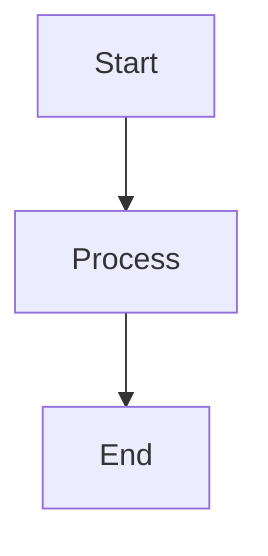

# mermaid-markdown-wrap

[English](README.md) | [日本語](README.ja.md)

A minimal CLI tool to wrap `.mmd` and `.mermaid` files (Mermaid diagrams) in Markdown code blocks without modifying the original content.

## Quick Start

```bash
# Install globally
npm install -g mermaid-markdown-wrap

# Create a configuration file (optional)
mermaid-markdown-wrap init

# Convert a Mermaid file to Markdown
mermaid-markdown-wrap diagram.mmd
```

## Features

- ✅ Convert `.mmd` and `.mermaid` files to Markdown with proper code blocks
- ✅ Batch processing with glob patterns
- ✅ Flexible configuration (YAML, JSON, JavaScript, TypeScript)
- ✅ GitHub Actions support
- ✅ Command validation and configuration inspection tools

## Usage

### Basic Examples

```bash
# Convert single file
mermaid-markdown-wrap diagram.mmd
mermaid-markdown-wrap flowchart.mermaid

# Convert multiple files
mermaid-markdown-wrap "*.mmd"                      # All .mmd files in current directory
mermaid-markdown-wrap "*.mermaid"                  # All .mermaid files
mermaid-markdown-wrap "**/*.{mmd,mermaid}"         # All Mermaid files recursively

# Specify output directory
mermaid-markdown-wrap "src/**/*.mmd" -o dist/      # Convert with output directory

# Add header/footer
mermaid-markdown-wrap "*.mermaid" --header "# Docs"

# Remove source files after conversion
mermaid-markdown-wrap diagram.mmd --remove-source

# Configuration
mermaid-markdown-wrap init                         # Create config file interactively
mermaid-markdown-wrap -c myconfig.yaml "*.mermaid" # Use specific config file
mermaid-markdown-wrap config-show                  # Show current configuration
mermaid-markdown-wrap config-show custom.yaml      # Show config from specific file
mermaid-markdown-wrap config-validate              # Validate config files
mermaid-markdown-wrap config-validate custom.json  # Validate specific file
```

### Options

| Option                | Description                          | Default       |
| --------------------- | ------------------------------------ | ------------- |
| `-o, --out-dir <dir>` | Output directory                     | Same as input |
| `--header <text>`     | Text to prepend to output            | -             |
| `--footer <text>`     | Text to append to output             | -             |
| `--remove-source`     | Remove source files                  | `false`       |
| `--hide-command`      | Hide command in output               | `false`       |
| `--log-format <format>`| Log output format: text or json      | `text`        |
| `--quiet`             | Suppress non-error output            | `false`       |
| `-c, --config <file>` | Config file path                     | Auto-search   |
| `-h, --help`          | Show help                            | -             |
| `-v, --version`       | Show version                         | -             |

## Commands

### Convert (default)

```bash
mermaid-markdown-wrap <input> [options]
```

Converts Mermaid files to Markdown. This is the default command when no subcommand is specified.

### Config Show

Display the current configuration:

```bash
# Show auto-discovered config
mermaid-markdown-wrap config-show

# Show specific config file
mermaid-markdown-wrap config-show myconfig.yaml
```

### Config Validate

Check configuration files for errors:

```bash
# Validate auto-discovered config
mermaid-markdown-wrap config-validate

# Validate specific config file
mermaid-markdown-wrap config-validate myconfig.json
```

### Init

Create a configuration file interactively:

```bash
mermaid-markdown-wrap init
```

This command will guide you through creating a configuration file by asking about:
- Configuration file format (TypeScript, JavaScript, JSON, YAML, etc.)
- Output directory
- Header/footer text
- Whether to remove source files
- Whether to hide command in output
- Log output format (text/json)
- Whether to suppress non-error output

## Configuration

The tool automatically searches for configuration files in the following locations (powered by [cosmiconfig](https://github.com/cosmiconfig/cosmiconfig)):

- `package.json` (`"mermaid-markdown-wrap"` property)
- `.mermaid-markdown-wraprc` (no extension)
- `.mermaid-markdown-wraprc.{json,yaml,yml,js,ts,mjs,cjs}`
- `.config/mermaid-markdown-wraprc` (no extension)
- `.config/mermaid-markdown-wraprc.{json,yaml,yml,js,ts,mjs,cjs}`
- `mermaid-markdown-wrap.config.{js,ts,mjs,cjs}`

You can also specify a config file using the `-c` option.

### YAML Configuration

```yaml
# .mermaid-markdown-wraprc.yaml
outDir: docs
header: "<!-- AUTO-GENERATED -->"
footer: "<!-- END -->"
removeSource: false
hideCommand: false
logFormat: text
quiet: false
```

> **Tip**: To enable IntelliSense for YAML files:
> 
> **Option 1 - VS Code Settings** (with [YAML extension](https://marketplace.visualstudio.com/items?itemName=redhat.vscode-yaml)):
> ```json
> // .vscode/settings.json
> {
>   "yaml.schemas": {
>     "https://unpkg.com/mermaid-markdown-wrap/schema/config.schema.json": [
>       ".mermaid-markdown-wraprc",
>       ".mermaid-markdown-wraprc.yaml",
>       ".mermaid-markdown-wraprc.yml",
>       ".config/mermaid-markdown-wraprc",
>       ".config/mermaid-markdown-wraprc.yaml",
>       ".config/mermaid-markdown-wraprc.yml"
>     ]
>   }
> }
> ```
> 
> **Option 2 - YAML Comment** (supported by some editors):
> ```yaml
> # yaml-language-server: $schema=https://unpkg.com/mermaid-markdown-wrap/schema/config.schema.json
> outDir: docs
> ```

### JSON Configuration (with Schema)

```json
// .mermaid-markdown-wraprc.json
{
  "$schema": "https://unpkg.com/mermaid-markdown-wrap/schema/config.schema.json",
  "outDir": "docs",
  "header": "<!-- AUTO-GENERATED -->",
  "footer": "<!-- END -->",
  "removeSource": false,
  "hideCommand": false,
  "logFormat": "text",
  "quiet": false
}
```

The `$schema` property enables IntelliSense, validation, and hover documentation in supported editors.

### JavaScript Configuration

```javascript
// .mermaid-markdown-wraprc.js

/** @type {import('mermaid-markdown-wrap/config').Config} */
module.exports = {
  outDir: 'docs',
  header: '<!-- AUTO-GENERATED -->',
  footer: '<!-- END -->',
  removeSource: false,
  hideCommand: false,
  logFormat: 'text',
  quiet: false,
};
```

The `@type` comment enables IntelliSense for JavaScript files.

### TypeScript Configuration

For TypeScript configurations, install the package locally to get type definitions:

```ts
// mermaid-markdown-wrap.config.ts
import type { Config } from 'mermaid-markdown-wrap/config';

const config: Config = {
  outDir: 'docs',
  header: '<!-- AUTO-GENERATED -->',
  footer: '<!-- END -->',
  removeSource: false,
  hideCommand: false,
  logFormat: 'text',
  quiet: false,
};

export default config;
```

## GitHub Actions

Use this tool in your CI/CD pipelines:

```yaml
name: Convert Mermaid Diagrams
on:
  push:
    paths: ["**/*.mmd", "**/*.mermaid"]

jobs:
  convert:
    runs-on: ubuntu-latest
    steps:
      - uses: actions/checkout@v4
      
      - uses: sugurutakahashi-1234/mermaid-markdown-wrap@v1
        with:
          input: "**/*.{mmd,mermaid}"
          out-dir: docs
          remove-source: true
```

### PR Comment Feature

Automatically post generated markdown files as PR comments:

```yaml
name: Convert and Comment
on:
  pull_request:
    types: [opened, synchronize]

jobs:
  convert:
    runs-on: ubuntu-latest
    permissions:
      contents: read
      pull-requests: write  # Required for posting comments
    steps:
      - uses: actions/checkout@v4
      
      - uses: sugurutakahashi-1234/mermaid-markdown-wrap@v1
        with:
          input: "**/*.{mmd,mermaid}"
          out-dir: docs
          pr-comment-mode: changed  # Options: 'off', 'changed', 'all'
```

#### PR Comment Options

| Option | Description | Default |
|--------|-------------|---------|
| `pr-comment-mode` | Comment posting mode: `'off'`, `'changed'`, `'all'` | `'off'` |
| `pr-comment-header` | Show header in PR comments | `'true'` |
| `pr-comment-details` | Use collapsible details for PR comments | `'false'` |
| `github-token` | GitHub token for PR comments | `${{ github.token }}` |

**PR Comment Modes:**
- `off` (default): No PR comments
- `changed`: Only comment files that were changed in the PR
- `all`: Comment all files generated in this run

**Example with all PR options:**
```yaml
- uses: sugurutakahashi-1234/mermaid-markdown-wrap@v1
  with:
    input: "**/*.{mmd,mermaid}"
    pr-comment-mode: all
    pr-comment-header: false      # Hide the header
    pr-comment-details: true      # Collapse content in details tag
    github-token: ${{ secrets.GITHUB_TOKEN }}  # Custom token (optional)
```

**Note:** Works with both `pull_request` and `pull_request_target` events. When using `pull_request_target`, be careful not to checkout untrusted PR code.

## How It Works

**Input** (`diagram.mmd`):
```
graph TD
  A[Start] --> B[Process]
  B --> C[End]
```

**Output** (`diagram.md`):
````markdown
```bash
mermaid-markdown-wrap diagram.mmd
```


````

## License

MIT