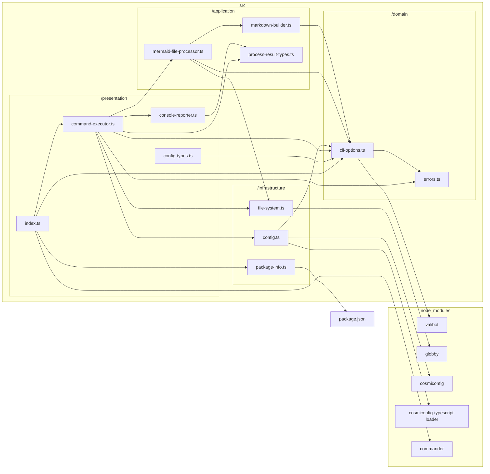

# TypeScript Graph

```bash
tsg --tsconfig tsconfig.build.json --LR --md docs/reports/dependencies/deps-graph.md
```


```mermaid
flowchart LR
    subgraph src["src"]
        subgraph src/domain["/domain"]
            src/domain/errors.ts["errors.ts"]
            src/domain/cli//options.ts["cli-options.ts"]
        end
        subgraph src/application["/application"]
            src/application/markdown//builder.ts["markdown-builder.ts"]
            src/application/mermaid//file//processor.ts["mermaid-file-processor.ts"]
            src/application/process//result//types.ts["process-result-types.ts"]
        end
        subgraph src/infrastructure["/infrastructure"]
            src/infrastructure/file//system.ts["file-system.ts"]
            src/infrastructure/config.ts["config.ts"]
            src/infrastructure/package//info.ts["package-info.ts"]
        end
        subgraph src/presentation["/presentation"]
            src/presentation/console//reporter.ts["console-reporter.ts"]
            src/presentation/command//executor.ts["command-executor.ts"]
            src/presentation/config//types.ts["config-types.ts"]
            src/presentation/index.ts["index.ts"]
        end
    end
    subgraph node//modules["node_modules"]
        node//modules/valibot/dist/index.d.cts["valibot"]
        node//modules/globby/index.d.ts["globby"]
        node//modules/cosmiconfig/dist/index.d.ts["cosmiconfig"]
        node//modules/cosmiconfig//typescript//loader/dist/types/index.d.ts["cosmiconfig-typescript-loader"]
        node//modules/commander/typings/index.d.ts["commander"]
    end
    src/domain/cli//options.ts-->node//modules/valibot/dist/index.d.cts
    src/domain/cli//options.ts-->src/domain/errors.ts
    src/application/markdown//builder.ts-->src/domain/cli//options.ts
    src/infrastructure/file//system.ts-->node//modules/globby/index.d.ts
    src/application/mermaid//file//processor.ts-->src/domain/cli//options.ts
    src/application/mermaid//file//processor.ts-->src/infrastructure/file//system.ts
    src/application/mermaid//file//processor.ts-->src/application/markdown//builder.ts
    src/infrastructure/config.ts-->node//modules/cosmiconfig/dist/index.d.ts
    src/infrastructure/config.ts-->node//modules/cosmiconfig//typescript//loader/dist/types/index.d.ts
    src/infrastructure/config.ts-->src/domain/cli//options.ts
    src/infrastructure/package//info.ts-->package.json
    src/presentation/console//reporter.ts-->src/application/process//result//types.ts
    src/presentation/command//executor.ts-->src/application/mermaid//file//processor.ts
    src/presentation/command//executor.ts-->src/application/process//result//types.ts
    src/presentation/command//executor.ts-->src/domain/cli//options.ts
    src/presentation/command//executor.ts-->src/domain/errors.ts
    src/presentation/command//executor.ts-->src/infrastructure/config.ts
    src/presentation/command//executor.ts-->src/infrastructure/file//system.ts
    src/presentation/command//executor.ts-->src/presentation/console//reporter.ts
    src/presentation/config//types.ts-->src/domain/cli//options.ts
    src/presentation/index.ts-->node//modules/commander/typings/index.d.ts
    src/presentation/index.ts-->src/domain/cli//options.ts
    src/presentation/index.ts-->src/infrastructure/package//info.ts
    src/presentation/index.ts-->src/presentation/command//executor.ts
```

