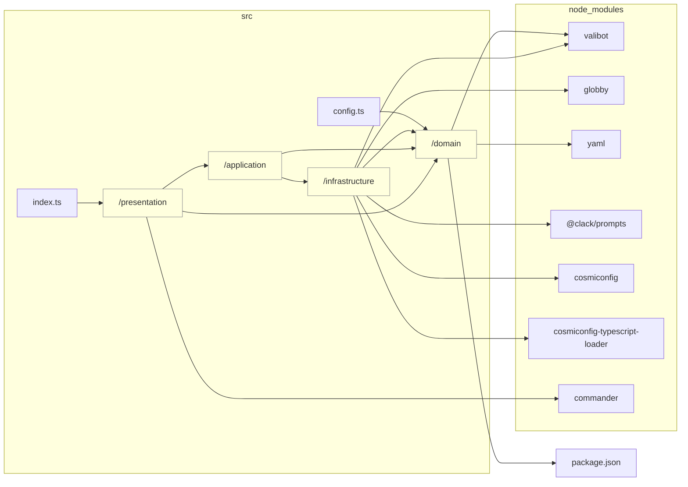

# TypeScript Graph

```bash
tsg --tsconfig tsconfig.build.json --LR --abstraction src/domain --abstraction src/application --abstraction src/infrastructure --abstraction src/presentation --md docs/reports/dependencies/layers.md
```



